# Modul 1: Introduction to CI/CD untuk Flutter

## 🎯 Learning Objectives

Setelah menyelesaikan modul ini, Anda akan dapat:
- Memahami konsep dasar CI/CD dan manfaatnya untuk Flutter development
- Mengidentifikasi komponen-komponen CI/CD pipeline
- Memahami alur kerja GitHub Actions untuk Flutter
- Setup project Flutter dengan struktur yang CI/CD friendly

## 📚 Materi Pembelajaran

### Apa itu CI/CD?

**Continuous Integration (CI)**
- Praktik pengembangan software dimana developer mengintegrasikan code ke shared repository secara berkala
- Setiap integrasi di-verifikasi oleh automated build dan automated tests
- Tujuan: mendeteksi error secepat mungkin

**Continuous Delivery (CD)**
- Ekstensi dari CI dimana software releases dapat disiapkan untuk production kapan saja
- Automated testing dan deployment ke staging environment
- Manual approval untuk production deployment

**Continuous Deployment**
- Lanjutan dari CD dimana deployment ke production terjadi otomatis
- Tidak ada human intervention dalam deployment process

### Mengapa CI/CD Penting untuk Flutter?

1. **Multi-Platform Complexity**
   - Flutter dapat build ke Android, iOS, Web, Desktop
   - Setiap platform memiliki requirements yang berbeda
   - CI/CD memastikan konsistensi cross-platform

2. **Quality Assurance**
   - Automated testing untuk semua platforms
   - Code quality checks (linting, formatting)
   - Performance testing

3. **Faster Delivery**
   - Automate repetitive tasks
   - Faster feedback loop
   - Reduced manual errors

4. **Team Collaboration**
   - Integration testing untuk team development
   - Consistent code standards
   - Easier code reviews

### CI/CD Pipeline Components untuk Flutter

```mermaid
graph LR
    A[Developer Push] --> B[Code Checkout]
    B --> C[Setup Flutter]
    C --> D[Install Dependencies]
    D --> E[Code Analysis]
    E --> F[Run Tests]
    F --> G[Build Applications]
    G --> H[Store Artifacts]
    H --> I[Deploy to Staging]
    I --> J[Manual Approval]
    J --> K[Deploy to Production]
```



#### Component Details:

1. **Trigger**
   - Git push ke branch
   - Pull request
   - Manual trigger
   - Scheduled trigger

2. **Setup Environment**
   - Flutter SDK installation
   - Platform-specific dependencies (Android SDK, Xcode)
   - Environment variables

3. **Code Quality Checks**
   - `dart analyze` untuk static analysis
   - `dart format` untuk code formatting
   - Custom linting rules

4. **Testing Suite**
   - Unit tests: `flutter test`
   - Widget tests: `flutter test`
   - Integration tests: `flutter test integration_test/`
   - Coverage reporting

5. **Build Process**
   - Android APK/AAB: `flutter build apk/appbundle`
   - iOS: `flutter build ios`
   - Web: `flutter build web`
   - Desktop: `flutter build windows/linux/macos`

6. **Artifact Management**
   - Store build files
   - Version tagging
   - Release notes generation

7. **Deployment**
   - Firebase Hosting untuk web
   - Google Play Console untuk Android
   - App Store Connect untuk iOS
   - Custom deployment scripts

### GitHub Actions untuk Flutter

GitHub Actions adalah CI/CD platform yang terintegrasi dengan GitHub. Keuntungannya:
- Free untuk public repositories
- Native GitHub integration
- Rich marketplace dengan pre-built actions
- YAML-based configuration

#### Basic Workflow Structure:
```yaml
name: CI Pipeline
on: [push, pull_request]
jobs:
  test:
    runs-on: ubuntu-latest
    steps:
      - uses: actions/checkout@v4
      - uses: subosito/flutter-action@v2
      - run: flutter test
```

## 🏗️ Project Structure untuk CI/CD

Struktur project yang CI/CD friendly:

```
simple_govhr_cicd/
├── .github/workflows/     # CI/CD configurations
│   ├── ci.yml            # Continuous integration
│   ├── release.yml       # Release management
│   └── deploy.yml        # Deployment scripts
├── lib/                  # Source code
├── test/                 # Tests
│   ├── unit/             # Unit tests
│   ├── widget/           # Widget tests
│   └── integration/      # Integration tests
├── integration_test/     # E2E tests
├── assets/              # Static assets
├── docs/                # Documentation
├── pubspec.yaml         # Dependencies
├── analysis_options.yaml # Code quality rules
└── README.md           # Project documentation
```

## 🔧 Key Concepts untuk Flutter CI/CD

### 1. Dependency Management
- Use `pubspec.yaml` untuk version locking
- Cache dependencies untuk faster builds
- Use `pub.lock` untuk reproducible builds

### 2. Environment Variables
- API keys dan secrets
- Build configurations
- Platform-specific settings

### 3. Testing Strategy
- Target 70%+ code coverage
- Test pyramid: lebih banyak unit tests
- Mock external dependencies

### 4. Build Optimization
- Use caching untuk dependencies
- Parallel builds untuk multiple platforms
- Incremental builds untuk faster iterations

### 5. Quality Gates
- Static analysis must pass
- All tests must pass
- Code coverage minimum
- Security scans

## 📊 Success Metrics

### CI/CD Pipeline Metrics:
1. **Build Time**: < 10 minutes
2. **Test Execution Time**: < 5 minutes
3. **Success Rate**: > 95%
4. **Mean Time to Recovery (MTTR)**: < 30 minutes

### Quality Metrics:
1. **Code Coverage**: > 70%
2. **Static Analysis**: Zero critical issues
3. **Test Pass Rate**: 100%
4. **Security Scan**: Zero critical vulnerabilities

## 🚀 Best Practices

1. **Start Small**
   - Mulai dengan basic CI (lint + test)
   - Tambahkan fitur secara bertahap
   - Monitor dan optimasi

2. **Fail Fast**
   - Jalankan test yang cepat dulu
   - Early feedback untuk developer
   - Prevent broken code di main branch

3. **Secure by Default**
   - Never commit secrets
   - Use environment variables
   - Regular security scanning

4. **Monitor Everything**
   - Build performance metrics
   - Test coverage trends
   - Deployment success rates

5. **Document Everything**
   - Pipeline documentation
   - Troubleshooting guides
   - Best practices guide

## 🎯 Hands-On Exercise

### Exercise 1.1: Project Analysis
**Objective**: Menganalisis struktur SimpleGovHR project

**Tasks**:
1. Examine project structure
2. Identify CI/CD components
3. Review testing setup
4. Analyze configuration files

**Questions**:
- Apa saja komponen CI/CD yang sudah ada?
- Bagaimana struktur testing yang digunakan?
- Platform apa saja yang didukung?

### Exercise 1.2: CI/DC Concepts Quiz
**Objective**: Test pemahaman konsep CI/CD

**Questions**:
1. Apa perbedaan antara CI dan CD?
2. Mengapa CI/CD penting untuk Flutter development?
3. Apa saja komponen dalam CI/CD pipeline?
4. Bagaimana GitHub Actions bekerja?

### Exercise 1.3: Project Setup Validation
**Objective**: Validasi project setup untuk CI/CD

**Tasks**:
1. Check apakah project sudah memiliki:
   - `analysis_options.yaml`
   - Testing structure
   - CI/CD workflows
   - Proper documentation

2. Run manual tests:
   ```bash
   flutter pub get
   flutter analyze
   flutter test
   ```

## 🔗 Resources

### Documentation:
- [Flutter Testing Documentation](https://flutter.dev/docs/testing)
- [GitHub Actions Documentation](https://docs.github.com/en/actions)
- [Continuous Integration Best Practices](https://docs.github.com/en/actions/guides)

### Tools:
- [Flutter Action for GitHub](https://github.com/marketplace/actions/flutter-action)
- [Codecov for Coverage](https://codecov.io/)
- [Flutter Doctor](https://flutter.dev/docs/development/tools/flutter-doctor)

### Communities:
- [Flutter GitHub Discussions](https://github.com/flutter/flutter/discussions)
- [Stack Overflow Flutter Tag](https://stackoverflow.com/questions/tagged/flutter)
- [Reddit r/FlutterDev](https://www.reddit.com/r/FlutterDev/)

## ✅ Completion Checklist

Setelah menyelesaikan modul ini, pastikan Anda dapat:
- [ ] Menjelaskan konsep CI/CD
- [ ] Mengidentifikasi komponen CI/CD pipeline
- [ ] Memahami GitHub Actions workflow
- [ ] Menganalisis project structure untuk CI/CD
- [ ] Menjalankan basic Flutter testing commands

## 📝 Notes

Gunakan section ini untuk mencatat pentingnya hal-hal dari modul ini:

1. Key concepts:
   -
   -
   -

2. Questions for instructor:
   -
   -
   -

3. Action items:
   -
   -
   -

---

**Next Module**: Coming soon - Comprehensive testing implementation untuk Flutter CI/CD.